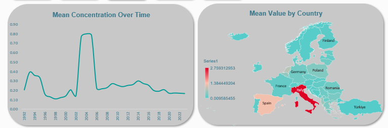
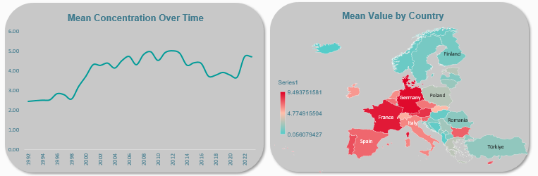
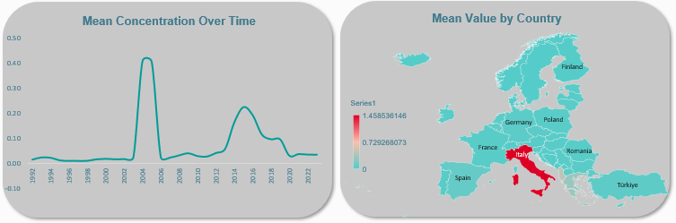
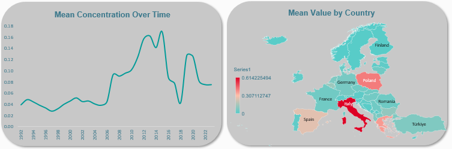
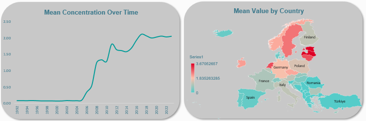
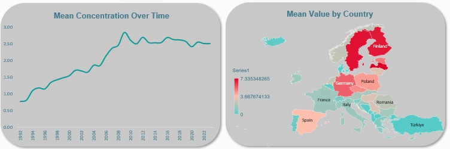
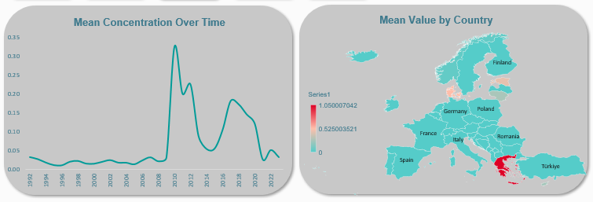
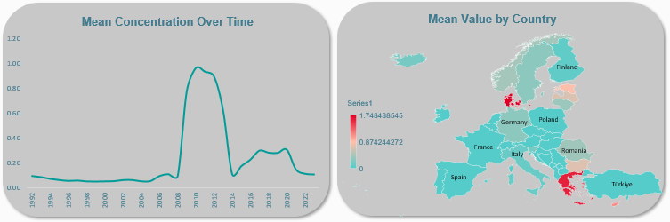
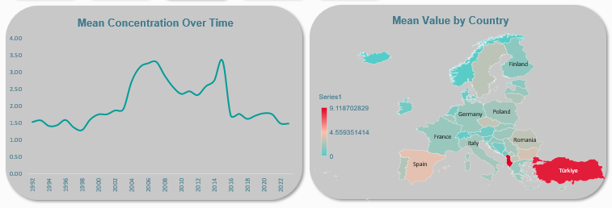

# Freshwater Trend in Europe

### Overview

Europe's freshwater systems might be under siege. Beneath the surface of rivers, lakes, and groundwater aquifers that sustain millions of lives, a chemical transformation is quietly unfolding. This is not just driven by pollution, but by the complex interaction of biochemical processes that govern nutrient cycling, oxygen dynamics, and ecological balance.

This report presents an aggregated analysis of freshwater biochemical trends across Europe, drawing on EEA indicator data to examine how biochemical activity shapes and threatens the environmental health of the continent's water bodies. Specifically, the objective of this study is to investigate the influence of biochemical processes on water quality classifications, ecological status distributions, and temporal variability in key biochemical indicators (mean concentrations, standard deviations, and minimum-maximum ranges across monitored sites). By studying these patterns across various water body categories and spatial scales, this analysis seeks to identify regions of critical concern, assess the trajectory of biochemical change, and provide an evidence-based foundation for informing future water management and environmental policy.

### Data Source

The dataset used for this analysis is sourced from [here](https://discomap.eea.europa.eu/App/DiscodataViewer/?fqn=[WISE_Indicators].[v6r1].[AggregatedData_Country])

### Tool

The tool used for this analysis is Microsoft Excel.

### Data Preparation

The tool used for this analysis is Microsoft Excel. The data was imported and transformed in Power Query. The first step was to remove the columns that would not be necessary for this project. Next, I ensured that the columns were in the right datatype.

Finally, I observed null values in some of the cells. Upon further study, I discovered that it was for the records with no data from the monitoring sites. Hence, I replaced the null values with zero.

By performing these data cleaning and profiling steps, I have ensured that the dataset is reliable, consistent, and ready for further analysis. This enhances the credibility and accuracy of the insights derived from the dataset.

### Analysis/ Findings

#### Ammonium
The 2003-2004 ammonium spike (0.80 mg/L peak) and subsequent sustained decline mirror improvements in EU wastewater treatment compliance. Italy remains a critical concern, with mean concentrations at 5.5x the threshold of 0.5 mg/L.

#### Nitrate
Nitrate is the single most widespread nutrient pollutant in European freshwaters. Germany and France's concentrations approach 9.49 mg/L. The 2021-2023 uptick signals that agricultural policy measures are not yet delivering measurable improvement at the continental scale

#### Nitrite
Italy's mean nitrite concentration of up to 1.46 mg/L is 14x the acute fish toxicity threshold. The 2004 continental spike (20x the baseline) represents the most extreme episodic pollution event recorded across all 12 indicators in this dataset.

#### Phosphate
Italy's phosphate concentration of up to 0.61 mg/L is 17x the eutrophication threshold. This represents an extreme eutrophication risk. The post-2005 continent-wide rising trend signals that phosphorus reduction policies have failed to contain agricultural and sewage phosphate inputs.

#### Total Phosphorus (TP)
Spain and Italy are the primary total phosphorus hotspots, with mean TP values exceeding the threshold. The absence of a declining 30-year trend confirms that phosphorus reduction targets under the threshold are not being achieved at the national scale in southern European hotspot countries.

#### Dissolved Organic Carbon (DOC)
The ~30-fold step-increase in mean DOC from 2004-2010, followed by stabilisation at ~3.0 mg/L, is the most dramatic structural shift observed across all 12 indicators. The Baltic states are the primary driver, which is a signal of climate-driven peatland DOC mobilisation that is expected to intensify through the 21st century.

#### Total Organic Carbon (TOC)
Finland and Sweden's mean TOC of up to 7.34 mg/L exceeds the EU Drinking Water Directive standard of 5 mg/L, creating direct challenges for safe water. The steady 30-year continental rise in TOC signals a systemic increase in freshwater organic loading driven by climate and land use change.

#### Chlorophyll A
Poland's mean chlorophyll A of up to 18.48 µg/L is 7x the threshold. This is one of the most severe ecological status exceedances in the entire dataset. The continent-wide 30-year upward trend represents a sustained, measurable erosion of lake ecosystem quality across Europe.

#### Cyanobacteria Biomass
Greece's mean cyanobacteria biomass of up to 1.05 mg/L exceeds the high-risk alert threshold for human and animal health. The similarity between the 2009-2011 bloom peak and European heat extremes demonstrates how climate warming amplifies bloom intensity in already nutrient-enriched systems.

#### Total Phythoplankton Biomass
The near-synchronous peaks of cyanobacteria and total phytoplankton biomass in 2009-2011 confirm a continent-wide bloom event of exceptional magnitude. Greece's total phytoplankton biomass of up to 1.75 mg/L places its monitored water bodies firmly in the hypereutrophic classification range.

#### BOD 5
Turkiye's mean BOD5 of up to 9.12 mg/L, which is more than 4x the threshold, signals severe organic pollution from inadequate wastewater treatment capacity. BOD5 is the indicator showing the clearest improvement signal across continental Europe, consistent with progress in Urban Wastewater Treatment Directive compliance.

#### Secchi Depth
Persistent Secchi depths of 0.6-1.0 m confirm that algal turbidity, driven by nutrient over-enrichment, is chronically impairing water clarity across European monitored lakes. The 2013 spike to 4.1 m is a data artefact and does not represent a genuine improvement in continental water transparency.

### Conclusion
The 30-year EEA monitoring record examined in this report presents a picture of European freshwaters under sustained and multifaceted biochemical pressure. The twelve indicators collectively reveal three dominant trends: 
(1) persistent and in some cases worsening nutrient enrichment (particularly nitrate and phosphate) across Central and Western Europe. 
(2) a structural and apparently irreversible rise in dissolved and total organic carbon across northern Europe, linked to climate-driven peatland mobilisation. 
(3) recurrent algal bloom intensification events that reflect the ecological consequences of accumulated nutrient loading amplified by warm temperature extremes.

These findings carry four clear policy implications. First, the persistent exceedance of the thresholds for nitrate in Germany, France, and Spain demands accelerated enforcement of agricultural nutrient management legislation and, where necessary, more ambitious binding reduction targets. Second, the identification of Italy as a multi-indicator pollution hotspot (ammonium, nitrite, phosphate, and BOD5) points to the need for targeted investment in both urban wastewater infrastructure and agricultural best management practices in high-impact regions. Third, the rising organic carbon trend in northern Europe requires dedicated attention in national water safety plans, particularly regarding drinking water treatment capability and climate adaptation. Fourth, the similarity between temperature extremes and cyanobacteria bloom peaks in 2009-2011 highlights the urgency of treating climate change as a freshwater quality risk multiplier, one that will continue to amplify the ecological consequences of eutrophication unless nutrient loading is first brought under control.

Without meaningful reductions in nutrient loading as a foundation, climate warming will systematically intensify the biochemical impairment of European freshwaters, making the dual challenge of pollution reduction and climate adaptation the defining water quality governance priority for the continent in the decades ahead.
